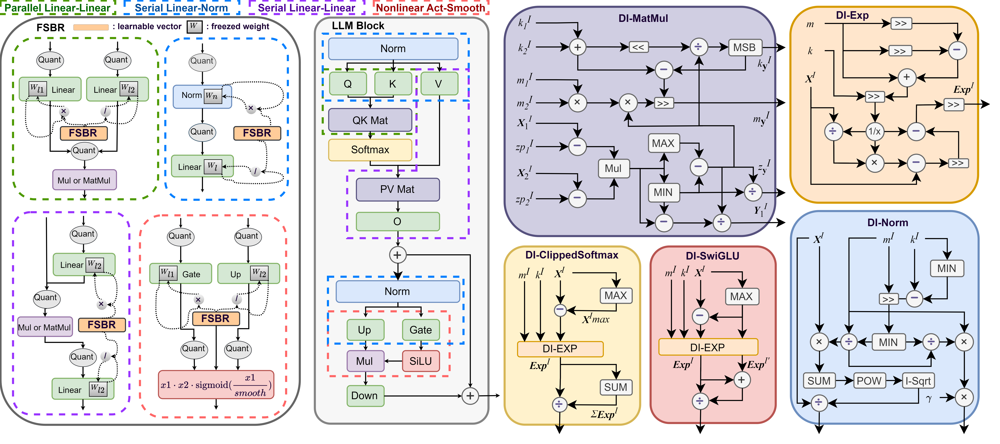
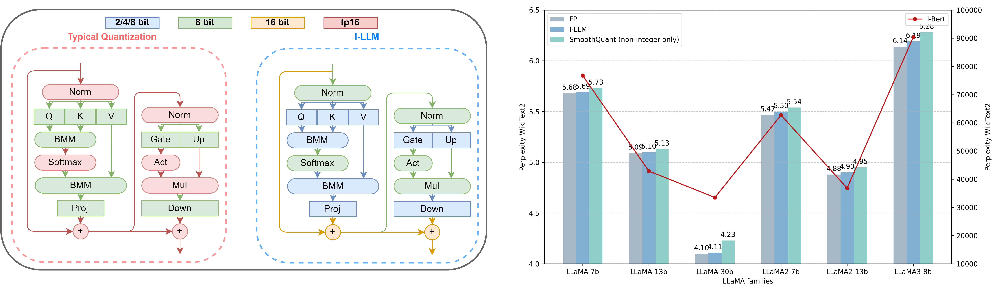

# I-LLM: Efficient Integer-Only Inference for Fully-Quantized Low-Bit Large Language Models

<div style="text-align: center;">
  
  <p>Details of I-LLM in a transformer block. The left side of the figure illustrates various paradigms for channel-wise smoothing during the FSBR process. The right side depicts the integer-only execution pipeline for both linear operators, such as matrix multiplication (MatMul), and non-linear operators.</p>
</div>

## Abstract
Post-training quantization (PTQ) serves as a potent technique to accelerate the inference of large language models (LLMs). Nonetheless, existing works still necessitate a considerable number of floating-point (FP) operations during inference, including additional quantization and de-quantization, as well as non-linear operators such as RMSNorm and Softmax. This limitation hinders the deployment of LLMs on the edge and cloud devices.  
In this paper, we identify the primary obstacle to integer-only quantization for LLMs lies in the large fluctuation of activations across channels and tokens in both linear and non-linear operations. To address this issue, we propose I-LLM, a novel integer-only fully-quantized PTQ framework tailored for LLMs. Specifically, (1) we develop Fully-Smooth Block-Reconstruction (FSBR) to aggressively smooth inter-channel variations of all activations and weights. (2) to alleviate degradation caused by inter-token variations, we introduce a novel approach called Dynamic Integer-only MatMul (DI-MatMul). This method enables dynamic quantization in full-integer matrix multiplication by dynamically quantizing the input and outputs with integer-only operations. (3) we design DI-ClippedSoftmax, DI-Exp, and DI-Normalization, which utilize bit shift to execute non-linear operators efficiently while maintaining accuracy.
The experiment shows that our I-LLM achieves comparable accuracy to the FP baseline and outperforms non-integer quantization methods. For example, I-LLM can operate at W4A4 with negligible loss of accuracy. To our knowledge, we are the first to bridge the gap between integer-only quantization and LLMs. 

## Characteristics

The most essential difference between us and traditional quantitative methods is shown as the fig below:
Typical LLM quantization vs. I-LLM.
The former requires dequantization and involves
FP arithmetic, while the latter performs the entire
inference using integer-only arithmetic.



## Usage
Let's take Llama2- 7b as an example
### 1. Fully-Smooth Block-Reconstruction


1. We first obtain the scales and shifts of activation
````python 
python generaget_act_scale_shift.py WEIGHTS/Llama2-7b-hf
````

2. FSBR
````
python main.py --model pts/Llama2-7b-hf --eval_ppl --epochs 20 --output_dir ./log/Llama2-7b_w4a8 --wbits 4 --abits 4 --lwc --let --fully_quant
````

### 2. Interger-only inference

````
python main.py --model pts/Llama2-7b-hf --eval_ppl --epochs 0 --output_dir ./log/Llama2-7b_w4a8/fsbr_parameters.pt --wbits 4 --abits 4 --lwc --let --fully_quant --illm
````
